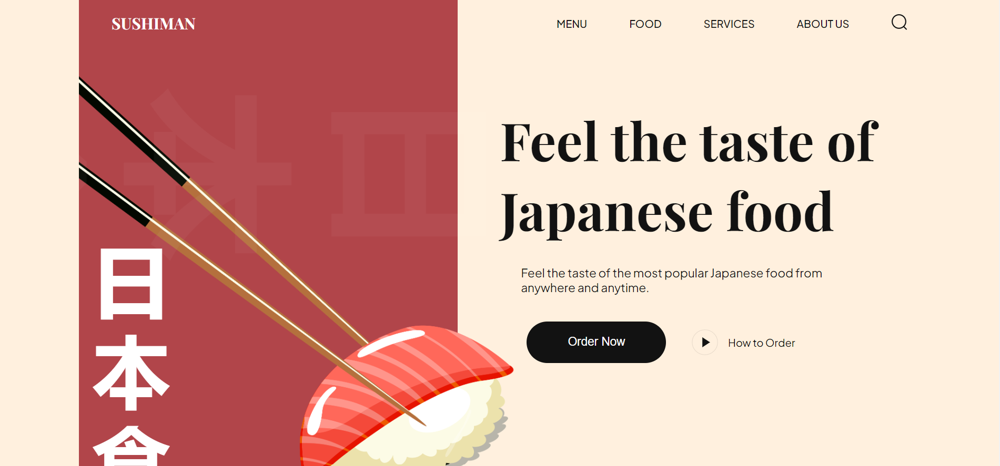

# SushiMan

Modern Responsive Website using HTML and CSS, also used AOS for onScroll Animation.

# Key Features
- Use CSS variables
- Import CSS files into other CSS files
- Use flex and position properties in CSS
- Create smooth and subtle animations

